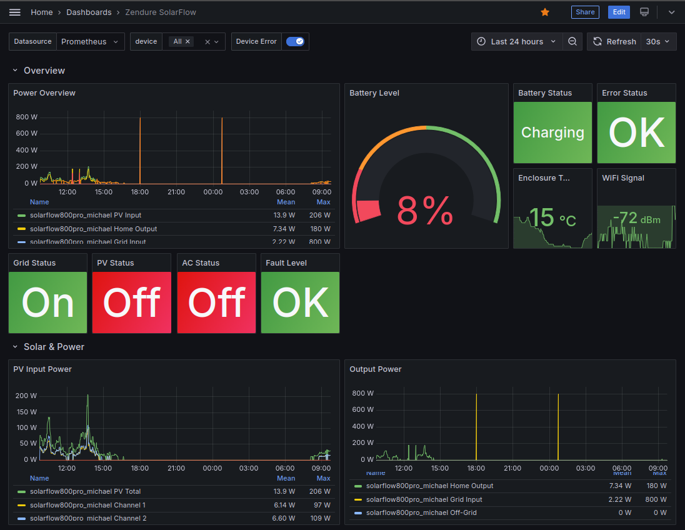
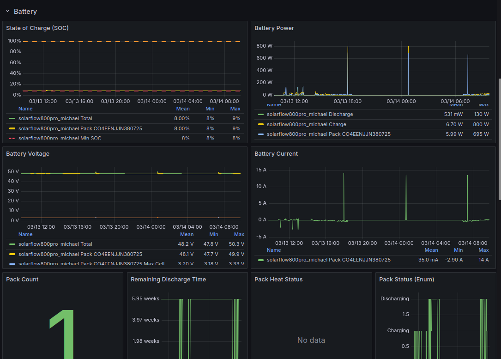
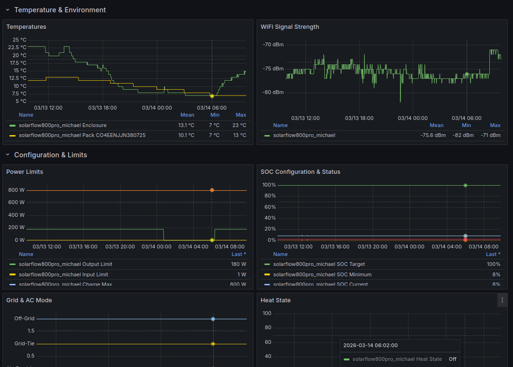

# Zendure Prometheus Exporter

[](https://github.com/PHPGangsta/zendure-exporter/actions/workflows/ci.yml)
[](https://goreportcard.com/report/github.com/PHPGangsta/zendure-exporter)
[](https://pkg.go.dev/github.com/PHPGangsta/zendure-exporter)
[](LICENSE)

A Prometheus exporter for [Zendure SolarFlow](https://www.zendure.com/) devices. Scrapes the local device HTTP API (`/properties/report`) and exposes all metrics on a single `/metrics` endpoint for Prometheus to consume.

No cloud account or internet connection required — works entirely on your local network.

## Supported Devices

- SolarFlow800
- SolarFlow800 Plus
- SolarFlow800 Pro
- SolarFlow1600 AC+
- SolarFlow2400 AC
- SolarFlow2400 AC+
- SolarFlow2400 Pro

## Architecture and Data Flow

```
┌──────────────┐   HTTP GET         ┌────────────────────┐     /metrics      ┌────────────┐
│  Zendure     │ /properties/report │  zendure-exporter  │◄──── scrape ──────│ Prometheus │
│  SolarFlow   │───────────────────►│  (this exporter)   │──────────────────►│            │
│  Device(s)   │   JSON response    │  :9854             │   Prometheus fmt  │  :9090     │
└──────────────┘                    └────────────────────┘                   └─────┬──────┘
                                                                                   │
                                                                            ┌──────▼──────┐
                                                                            │   Grafana   │
                                                                            └─────────────┘
```

**Flow:**

1. Prometheus scrapes `zendure-exporter:9854/metrics` every 15 seconds.
2. On each scrape, the exporter fetches `/properties/report` from every configured (and enabled) Zendure device via HTTP GET.
3. The JSON response is parsed, fields are mapped to Prometheus metrics (with unit conversions where needed), and exposed in Prometheus exposition format.
4. If a device is unreachable, no metrics are emitted for that device (Prometheus handles staleness natively). The exporter process stays alive and retries on the next scrape.
5. Grafana queries Prometheus to visualize the metrics.

**Key design decisions:**

- **One exporter, many devices.** A single exporter instance serves metrics for all configured Zendure devices. Individual devices are distinguished by `device_id` and `device_model` labels.
- **No caching.** Every Prometheus scrape triggers fresh HTTP requests to all devices. This keeps data current and avoids stale value issues.
- **Fail-fast per device.** A timeout or error on one device does not block or delay metrics from other devices.

## Quick Start

### Using Docker Compose (recommended)

```bash
# Copy and edit config
cp config.example.yml config.yml
# Edit config.yml with your device IPs and IDs

# Build and start
docker compose up -d

# View logs
docker compose logs -f
```

### Using a pre-built Docker image

Multi-arch images (amd64, arm64, arm/v7) are published to GitHub Container Registry on every release:

```bash
docker run -d \
  --name zendure-exporter \
  -p 9854:9854 \
  -v $(pwd)/config.yml:/etc/zendure-exporter/config.yml:ro \
  ghcr.io/phpgangsta/zendure-exporter:latest
```

### Using Docker directly (build from source)

```bash
# Build
docker build -t zendure-exporter .

# Run (mount your config file)
docker run -d \
  --name zendure-exporter \
  -p 9854:9854 \
  -v $(pwd)/config.yml:/etc/zendure-exporter/config.yml:ro \
  zendure-exporter
```

### Query metrics

```bash
curl http://localhost:9854/metrics
```

> **Note:** If the Zendure devices are on your local LAN and not reachable from the
> Docker bridge network, use `network_mode: host` in `docker-compose.yml` or
> `--network host` with `docker run`.

## Configuration Reference

Copy `config.example.yml` to `config.yml` and adjust to your setup.

```yaml
listen_addr: 0.0.0.0
listen_port: 9854
discovery_mode: false
debug: false
device_request_timeout_seconds: 5

devices:
  - id: sf800pro_basement
    model: SolarFlow800 Pro
    base_url: http://192.168.1.101
    enabled: true
  - id: sf2400ac_apartment2
    model: SolarFlow2400 AC
    base_url: http://192.168.1.102
    enabled: true
    timeout_seconds: 10  # optional per-device timeout override
```

### Global Settings

| Field | Type | Default | Description |
|-------|------|---------|-------------|
| `listen_addr` | string | `0.0.0.0` | Address to bind the HTTP server |
| `listen_port` | int | `9854` | Port for `/metrics` and `/health` endpoints (1–65535) |
| `discovery_mode` | bool | `false` | Expose unknown numeric fields as `zendure_unknown_property` gauge (see [Discovery Mode](#discovery-mode)) |
| `debug` | bool | `false` | Enable debug logging (includes raw API payloads) |
| `device_request_timeout_seconds` | int | `5` | HTTP timeout per device request in seconds (≥ 1) |

### Per-Device Settings

| Field | Type | Required | Description |
|-------|------|----------|-------------|
| `id` | string | **yes** | Unique device identifier (used as `device_id` label) |
| `model` | string | no | Device model name (used as `device_model` label, e.g. `SolarFlow800 Pro`) |
| `base_url` | string | **yes** | Base URL of the device (must use `http` or `https` scheme, e.g. `http://192.168.1.101`). The exporter appends `/properties/report` |
| `enabled` | bool | no | Set to `false` to skip this device. At least one device must be enabled |
| `timeout_seconds` | int | no | Per-device HTTP timeout override (≥ 1). Falls back to global `device_request_timeout_seconds` if unset |

### Validate Config

```bash
zendure-exporter --check-config --config config.yml
```

Exits `0` with `OK` on valid config, non-zero with an actionable error message on invalid config.

### Show Version

```bash
zendure-exporter --version
```

The version is typically "dev" when built locally without flags, or set to the Git tag when built via CI or Docker.

## Endpoints

| Path       | Description                 |
|------------|-----------------------------|
| `/metrics` | Prometheus metrics endpoint |
| `/health`  | Health check (returns `OK`) |
| `/ready`   | Readiness probe — returns `200 READY` after at least one successful device scrape, `503 NOT READY` otherwise. Useful for Kubernetes readiness probes |

## Grafana Dashboard

A ready-to-use Grafana dashboard is included in [`grafana/zendure-solarflow.json`](grafana/zendure-solarflow.json). Import it into your Grafana instance via **Dashboards → Import → Upload JSON file**.

The dashboard visualizes all key metrics: solar input, battery state, output power, temperatures, and device status.





## Metrics

All metrics use the `zendure_` prefix. Every device-level metric carries `device_id` and `device_model` labels.

For the complete metric catalog including all device metrics, battery pack metrics, exporter self-metrics, enum value tables, and conversion rules, see [documentation/metric-spec.md](documentation/metric-spec.md).

## Discovery Mode

When `discovery_mode: true` is set in the config, the exporter exposes any **unknown numeric fields** from the device API response as:

```
zendure_unknown_property{device_id="...", device_model="...", field="<field_name>"} <value>
```

Unknown fields are also always logged at warn level regardless of discovery mode, to help detect firmware changes early.

**Recommended usage:**

- Enable discovery mode temporarily when commissioning a new device or after a firmware update to identify new fields.
- Disable it in production (`discovery_mode: false`) to keep the metric output clean and predictable.

## Troubleshooting

### Exporter starts but all metrics show `scrape_success=0`

- **Device unreachable:** Verify the device IP is reachable from the exporter host: `curl http://<device-ip>/properties/report`
- **Docker networking:** If using Docker bridge networking, the device LAN may not be reachable. Use `network_mode: host` in `docker-compose.yml`.
- **Timeout too low:** Increase `device_request_timeout_seconds` if the device responds slowly.

### No metrics for a specific device

- Check that the device is set to `enabled: true` in `config.yml`.
- Check the exporter logs for error messages referencing the device ID.
- Verify the `base_url` is correct (no trailing slash needed, the exporter appends `/properties/report`).

### Unknown or unexpected fields in logs

- The exporter logs unknown fields at warn level. This typically happens after a firmware update adds new API fields.
- Enable `discovery_mode: true` temporarily to see their values as Prometheus metrics.
- Consider adding them to the metric mapping (see [Maintenance: Adding New Fields](#adding-new-zendure-fieldsmmetrics)).

### Debugging raw API responses

Enable `debug: true` in config to log the raw JSON payload from each device on every scrape. **Disable in production** as this generates significant log volume.

### Config validation errors

Run `zendure-exporter --check-config --config config.yml` to validate the config without starting the exporter. Common issues:

- Missing `id` or `base_url` on a device
- `base_url` without `http` or `https` scheme
- `listen_port` outside range 1–65535
- `device_request_timeout_seconds` less than 1
- Negative `timeout_seconds` on a device
- No enabled devices

### High scrape duration

If `zendure_exporter_scrape_duration_seconds` is consistently high, check:

- Network latency to the devices
- Number of configured devices (requests run in parallel, but the slowest device determines total scrape time)
- `device_request_timeout_seconds` — a timed-out device adds its full timeout to scrape duration
- Check `zendure_exporter_device_fetch_duration_seconds` to identify which device is slowest

## Prometheus Integration

Add the following scrape job to `prometheus/prometheus.yml`:

```yaml
scrape_configs:
  - job_name: 'zendure_exporter'
    scrape_interval: 15s
    scrape_timeout: 10s
    static_configs:
      - targets: ['zendure-exporter:9854']
```

A single exporter instance serves metrics for all configured devices. Individual devices are distinguished by `device_id` and `device_model` labels on every metric. Battery packs additionally carry a `pack_sn` label, and per-PV-channel metrics have a `channel` label.

## Maintenance

### Adding New Zendure Fields/Metrics

When a firmware update introduces new API fields or you want to expose additional fields:

1. **Identify the new field.** Enable `discovery_mode: true` or check warn-level log messages for unknown field names and their values.
2. **Add field mapping** in `internal/client/client.go`:
   - Add a new entry to `deviceFieldMap` (device-level) or `packFieldMap` (battery pack-level) mapping the JSON field name to the Prometheus metric name.
   - If the field needs conversion (temperature, voltage, current), add the conversion in the `parsePayload()` function.
3. **Add metric descriptor** in `internal/collector/collector.go`:
   - Add a `prometheus.NewDesc()` call for the new metric.
   - Add a `MustNewConstMetric()` call in the `Collect()` method.
4. **Add tests** in the corresponding `_test.go` files.
5. **Update documentation:**
   - Add the metric to `documentation/metric-spec.md`.
   - Add the metric to the catalog table in this README.
6. **Rebuild and test:** `go build ./cmd/zendure-exporter && go test ./...`

### Firmware / API Compatibility

- The exporter is built against the Zendure zenSDK documentation (see `documentation/zenSDK-en_properties.md`).
- The local HTTP API (`/properties/report`) may change between firmware versions. The exporter handles this gracefully:
  - **Missing fields** are silently skipped (no metric emitted for that field).
  - **Unknown fields** are logged at warn level and optionally exposed in discovery mode.
  - **Type changes** (e.g. a number becoming a string) are handled safely — non-numeric values are ignored.
- After a firmware update, check the exporter logs for warnings about unknown fields and verify that expected metrics are still present.

### Versioning and Release Notes

- This project uses Git tags for versioning (e.g., `v1.0.0`).
- The version string is injected into the binary at build time using `-ldflags`.
- When making changes, update the relevant documentation (`README.md`, `metric-spec.md`).

## Development

### Prerequisites

- Go 1.23+ installed

### Build

```bash
# Basic build (version will be "dev")
go build ./cmd/zendure-exporter

# Build with specific version
go build -ldflags="-X main.version=v1.0.0" ./cmd/zendure-exporter
```

### Run Tests

```bash
go test ./...
```

For verbose output:

```bash
go test ./... -v
```

### Smoke Test

```bash
bash scripts/smoke-test.sh
```

## Port

Default listen port: **9854**

## License

This project is licensed under the MIT License — see the [LICENSE](LICENSE) file for details.
